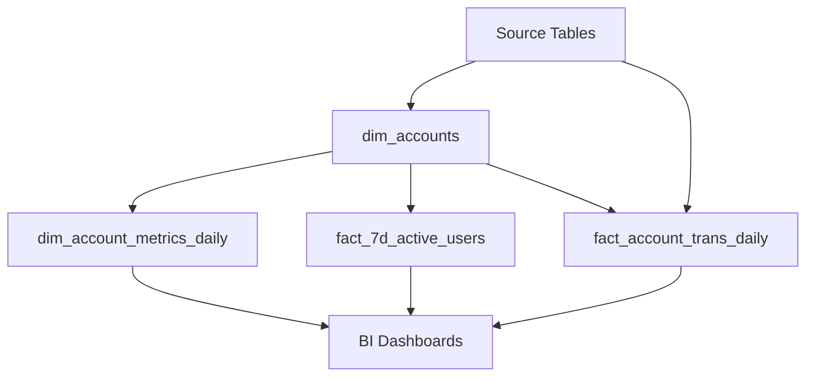

# Monzo Data Warehouse

A comprehensive data warehouse solution for Monzo's account and transaction analytics, built on Google BigQuery with dimensional modeling best practices.

## 📊 Project Overview

This project implements a modern data warehouse architecture for analyzing Monzo account lifecycle events and transaction patterns. The solution provides historical point-in-time analytics capabilities with pre-calculated metrics for business intelligence and reporting.

### Key Features

- **Historical Backfill Support**: Point-in-time calculations for any date range
- **Dimensional Modeling**: Star schema with fact and dimension tables
- **Pre-calculated Metrics**: Rolling 7d/30d transaction windows and activity flags
- **Account Lifecycle Tracking**: Complete account status history (open/closed/reopened)
- **BigQuery Optimized**: Partitioned tables and optimized queries for large datasets

## 🏗️ Architecture

### Data Model Structure

```
📁 sql/
├── 📁 tables/          # Main data warehouse tables
│   ├── dim_accounts.sql                 # Master account dimension
│   ├── dim_account_metrics_daily.sql    # Daily account snapshots
│   ├── fact_7d_active_users.sql         # 7-day active user KPIs
│   └── fact_account_trans_daily.sql     # Daily transaction facts
├── 📁 views/           # Analytical views
└── 📁 dashboard/       # BI dashboards and visualizations
```

### Entity Relationship Diagram

See [`ERD_Diagram.md`](./ERD_Diagram.md) for detailed table relationships and data flow.

## 📋 Table Specifications

### Core Tables

| Table | Type | Purpose | Partition | Refresh |
|-------|------|---------|-----------|---------|
| `dim_accounts` | Dimension | Master account data with lifecycle tracking | `metric_date` | Daily |
| `dim_account_metrics_daily` | Dimension | Daily account metric snapshots | `metric_date` | Daily |
| `fact_7d_active_users` | Fact | 7-day active user KPI calculations | `metric_date` | Daily |
| `fact_account_trans_daily` | Fact | Daily transaction aggregates | `trans_date` | Daily |

### Key Metrics Calculated

- **7d Active Users**: Users with transactions in last 7 days / Users with open accounts
- **Account Status**: Point-in-time open/closed status with closure/reopening history
- **Rolling Windows**: 7-day and 30-day transaction totals with historical accuracy
- **Activity Flags**: Account activity indicators for segmentation and analysis

## 🚀 Getting Started

### Prerequisites

- Google BigQuery access with appropriate permissions
- BigQuery dataset: `GD_take_home_task`
- Source data in: `analytics-take-home-test.monzo_datawarehouse`

### Quick Setup

1. **Clone the repository**
   ```bash
   git clone <repository-url>
   cd Monzo
   ```

2. **Create BigQuery tables**
   ```sql
   -- Run DDL statements from each table file
   -- Example:
   CREATE TABLE GD_take_home_task.dim_accounts (...)
   ```

3. **Execute initial backfill**
   ```sql
   -- Run ETL queries for historical data (2020-08-01 to 2020-08-12)
   -- Start with dim_accounts, then other tables
   ```

### Data Flow



## 📊 Sample Queries

### 7-Day Active User Trend
```sql
SELECT 
  metric_date,
  total_users_with_open_accounts,
  active_users_7d,
  active_rate_7d
FROM GD_take_home_task.fact_7d_active_users 
ORDER BY metric_date;
```

### Account Status Distribution
```sql
SELECT 
  current_status,
  COUNT(*) as account_count,
  COUNT(*) * 100.0 / SUM(COUNT(*)) OVER() as percentage
FROM GD_take_home_task.dim_accounts 
WHERE metric_date = '2020-08-12'
GROUP BY current_status;
```

### Top Active Accounts
```sql
SELECT 
  account_id_hashed,
  transactions_last_7d,
  transactions_last_30d,
  total_transactions
FROM GD_take_home_task.dim_accounts 
WHERE metric_date = '2020-08-12' 
  AND current_status = 'OPEN'
ORDER BY transactions_last_7d DESC 
LIMIT 10;
```

## 🔄 ETL Process

### Execution Order
1. `dim_accounts.sql` - Master dimension (run first)
2. `dim_account_metrics_daily.sql` - Daily snapshots
3. `fact_7d_active_users.sql` - Active user metrics
4. `fact_account_trans_daily.sql` - Transaction facts

### Backfill Strategy
- **Single Date Processing**: Each query processes one date at a time for optimal performance
- **Date Range**: 2020-08-01 to 2020-08-12 (12 days)
- **Dependencies**: Ensure `dim_accounts` completes before running dependent tables

### Production Scheduling
```sql
-- Example for daily production run
DECLARE TARGET_DATE DATE DEFAULT CURRENT_DATE();
-- Run each ETL query with TARGET_DATE
```

## 📈 Business Metrics

### 7d Active Users KPI
**Definition**: Users with transactions in last 7 days ÷ Users with at least one open account

**Business Context**: 
- Primary engagement metric for product teams
- Tracks user activity trends over time
- Enables cohort analysis and user segmentation

### Account Lifecycle Tracking
- **Creation**: Account opening events
- **Closure**: Account closure with timestamp tracking
- **Reopening**: Account reactivation handling
- **Status**: Point-in-time status determination

## 🛠️ Technical Details

### BigQuery Optimizations
- **Partitioning**: All tables partitioned by date for query performance
- **Clustering**: Consider adding clustering keys for frequently filtered columns
- **Data Types**: Optimized for BigQuery (STRING for hashed IDs, INT64 for counts)

### Data Quality
- **Point-in-Time Accuracy**: Historical consistency maintained across all calculations
- **Null Handling**: Comprehensive null checks and default values
- **Data Validation**: Built-in validation through dimensional modeling constraints

### Performance Considerations
- **Single Date Processing**: Queries designed for one date at a time
- **Pre-calculated Metrics**: Complex calculations centralized in dimension tables
- **Minimal Joins**: Fact tables leverage pre-computed dimension metrics

## 📁 File Structure

```
Monzo/
├── README.md                           # This file
├── ERD_Diagram.md                      # Entity relationship diagram
├── Monzo.code-workspace               # VS Code workspace configuration
├── sql/
│   ├── tables/                        # Main data warehouse tables
│   │   ├── dim_accounts.sql           # Master account dimension
│   │   ├── dim_account_metrics_daily.sql  # Daily account snapshots  
│   │   ├── fact_7d_active_users.sql   # 7-day active user KPIs
│   │   └── fact_account_trans_daily.sql   # Daily transaction facts
│   └── views/                         # Analytical views
│       ├── dim_accounts_view.sql      # Account dimension view
│       ├── dim_account_metrics_daily_view.sql  # Daily metrics view
│       ├── fact_7d_active_users_view.sql      # Active users view
│       └── fact_account_trans_daily_view.sql  # Transaction facts view
└── dashboard/                         # BI dashboards and reports
    ├── images/                        # Dashboard screenshots
    └── ascii/                         # ASCII art dashboards
        ├── 7 day active users.txt
        ├── account health.txt
        ├── active users weekly.txt
        ├── churn risk.txt
        ├── monzo transaction intelligence.txt
        ├── monzo transaction intelligence 2.txt
        ├── user engagement.txt
        └── user engagement 2.txt
```

## 🤝 Contributing

### Development Workflow
1. Create feature branch from `main`
2. Implement changes following existing patterns
3. Test queries with sample data
4. Update documentation as needed
5. Submit pull request with clear description

### Code Standards
- **SQL Style**: Consistent formatting with clear comments
- **Naming**: Descriptive table and column names
- **Documentation**: Comprehensive header comments for all files
- **Version Control**: Include query version and change history

## 📄 License

This project is part of Monzo's data infrastructure. Please refer to company policies for usage guidelines.

## 👥 Team

**Created By**: Geoffrey Devitt  
**Created Date**: 2025-10-21  
**Project Type**: Data Warehouse Implementation  
**Technology Stack**: Google BigQuery, SQL, Dimensional Modeling

---

For questions or support, please refer to the data engineering team documentation or create an issue in this repository.
# Monzo Data Warehouse

A comprehensive data warehouse solution for Monzo's account and transaction analytics, built on Google BigQuery with dimensional modeling best practices.

## 📊 Project Overview

This project implements a modern data warehouse architecture for analyzing Monzo account lifecycle events and transaction patterns. The solution provides historical point-in-time analytics capabilities with pre-calculated metrics for business intelligence and reporting.

### Key Features

- **Historical Backfill Support**: Point-in-time calculations for any date range
- **Dimensional Modeling**: Star schema with fact and dimension tables
- **Pre-calculated Metrics**: Rolling 7d/30d transaction windows and activity flags
- **Account Lifecycle Tracking**: Complete account status history (open/closed/reopened)
- **BigQuery Optimized**: Partitioned tables and optimized queries for large datasets

## 🏗️ Architecture

### Data Model Structure

```
📁 sql/
├── 📁 tables/          # Main data warehouse tables
│   ├── dim_accounts.sql                 # Master account dimension
│   ├── dim_account_metrics_daily.sql    # Daily account snapshots
│   ├── fact_7d_active_users.sql         # 7-day active user KPIs
│   └── fact_account_trans_daily.sql     # Daily transaction facts
├── 📁 views/           # Analytical views
└── 📁 dashboard/       # BI dashboards and visualizations
```

### Entity Relationship Diagram

See [`ERD_Diagram.md`](./ERD_Diagram.md) for detailed table relationships and data flow.

## 📋 Table Specifications

### Core Tables

| Table | Type | Purpose | Partition | Refresh |
|-------|------|---------|-----------|---------|
| `dim_accounts` | Dimension | Master account data with lifecycle tracking | `metric_date` | Daily |
| `dim_account_metrics_daily` | Dimension | Daily account metric snapshots | `metric_date` | Daily |
| `fact_7d_active_users` | Fact | 7-day active user KPI calculations | `metric_date` | Daily |
| `fact_account_trans_daily` | Fact | Daily transaction aggregates | `trans_date` | Daily |

### Key Metrics Calculated

- **7d Active Users**: Users with transactions in last 7 days / Users with open accounts
- **Account Status**: Point-in-time open/closed status with closure/reopening history
- **Rolling Windows**: 7-day and 30-day transaction totals with historical accuracy
- **Activity Flags**: Account activity indicators for segmentation and analysis

## 🚀 Getting Started

### Prerequisites

- Google BigQuery access with appropriate permissions
- BigQuery dataset: `GD_take_home_task`
- Source data in: `analytics-take-home-test.monzo_datawarehouse`

### Quick Setup

1. **Clone the repository**
   ```bash
   git clone <repository-url>
   cd Monzo
   ```

2. **Create BigQuery tables**
   ```sql
   -- Run DDL statements from each table file
   -- Example:
   CREATE TABLE GD_take_home_task.dim_accounts (...)
   ```

3. **Execute initial backfill**
   ```sql
   -- Run ETL queries for historical data (2020-08-01 to 2020-08-12)
   -- Start with dim_accounts, then other tables
   ```

### Data Flow


## 📊 Sample Queries

### 7-Day Active User Trend
```sql
SELECT 
  metric_date,
  total_users_with_open_accounts,
  active_users_7d,
  active_rate_7d
FROM GD_take_home_task.fact_7d_active_users 
ORDER BY metric_date;
```

### Account Status Distribution
```sql
SELECT 
  current_status,
  COUNT(*) as account_count,
  COUNT(*) * 100.0 / SUM(COUNT(*)) OVER() as percentage
FROM GD_take_home_task.dim_accounts 
WHERE metric_date = '2020-08-12'
GROUP BY current_status;
```

### Top Active Accounts
```sql
SELECT 
  account_id_hashed,
  transactions_last_7d,
  transactions_last_30d,
  total_transactions
FROM GD_take_home_task.dim_accounts 
WHERE metric_date = '2020-08-12' 
  AND current_status = 'OPEN'
ORDER BY transactions_last_7d DESC 
LIMIT 10;
```

## 🔄 ETL Process

### Execution Order
1. `dim_accounts.sql` - Master dimension (run first)
2. `dim_account_metrics_daily.sql` - Daily snapshots
3. `fact_7d_active_users.sql` - Active user metrics
4. `fact_account_trans_daily.sql` - Transaction facts

### Backfill Strategy
- **Single Date Processing**: Each query processes one date at a time for optimal performance
- **Date Range**: 2020-08-01 to 2020-08-12 (12 days)
- **Dependencies**: Ensure `dim_accounts` completes before running dependent tables

### Production Scheduling
```sql
-- Example for daily production run
DECLARE TARGET_DATE DATE DEFAULT CURRENT_DATE();
-- Run each ETL query with TARGET_DATE
```

## 📈 Business Metrics

### 7d Active Users KPI
**Definition**: Users with transactions in last 7 days ÷ Users with at least one open account

**Business Context**: 
- Primary engagement metric for product teams
- Tracks user activity trends over time
- Enables cohort analysis and user segmentation

### Account Lifecycle Tracking
- **Creation**: Account opening events
- **Closure**: Account closure with timestamp tracking
- **Reopening**: Account reactivation handling
- **Status**: Point-in-time status determination

## 🛠️ Technical Details

### BigQuery Optimizations
- **Partitioning**: All tables partitioned by date for query performance
- **Clustering**: Consider adding clustering keys for frequently filtered columns
- **Data Types**: Optimized for BigQuery (STRING for hashed IDs, INT64 for counts)

### Data Quality
- **Point-in-Time Accuracy**: Historical consistency maintained across all calculations
- **Null Handling**: Comprehensive null checks and default values
- **Data Validation**: Built-in validation through dimensional modeling constraints

### Performance Considerations
- **Single Date Processing**: Queries designed for one date at a time
- **Pre-calculated Metrics**: Complex calculations centralized in dimension tables
- **Minimal Joins**: Fact tables leverage pre-computed dimension metrics

## 📁 File Structure

```
Monzo/
├── README.md                           # This file
├── ERD_Diagram.md                      # Entity relationship diagram
├── Monzo.code-workspace               # VS Code workspace configuration
├── sql/
│   ├── tables/                        # Main data warehouse tables
│   │   ├── dim_accounts.sql           # Master account dimension
│   │   ├── dim_account_metrics_daily.sql  # Daily account snapshots  
│   │   ├── fact_7d_active_users.sql   # 7-day active user KPIs
│   │   └── fact_account_trans_daily.sql   # Daily transaction facts
│   └── views/                         # Analytical views
│       ├── dim_accounts_view.sql      # Account dimension view
│       ├── dim_account_metrics_daily_view.sql  # Daily metrics view
│       ├── fact_7d_active_users_view.sql      # Active users view
│       └── fact_account_trans_daily_view.sql  # Transaction facts view
└── dashboard/                         # BI dashboards and reports
    ├── images/                        # Dashboard screenshots
    └── ascii/                         # ASCII art dashboards
        ├── 7 day active users.txt
        ├── account health.txt
        ├── active users weekly.txt
        ├── churn risk.txt
        ├── monzo transaction intelligence.txt
        ├── monzo transaction intelligence 2.txt
        ├── user engagement.txt
        └── user engagement 2.txt
```

## 🤝 Contributing

### Development Workflow
1. Create feature branch from `main`
2. Implement changes following existing patterns
3. Test queries with sample data
4. Update documentation as needed
5. Submit pull request with clear description

### Code Standards
- **SQL Style**: Consistent formatting with clear comments
- **Naming**: Descriptive table and column names
- **Documentation**: Comprehensive header comments for all files
- **Version Control**: Include query version and change history

## 📄 License

This project is part of Monzo's data infrastructure. Please refer to company policies for usage guidelines.

## 👥 Team

**Created By**: Geoffrey Devitt  
**Created Date**: 2025-10-21  
**Project Type**: Data Warehouse Implementation  
**Technology Stack**: Google BigQuery, SQL, Dimensional Modeling

---

For questions or support, please refer to the data engineering team documentation or create an issue in this repository.
